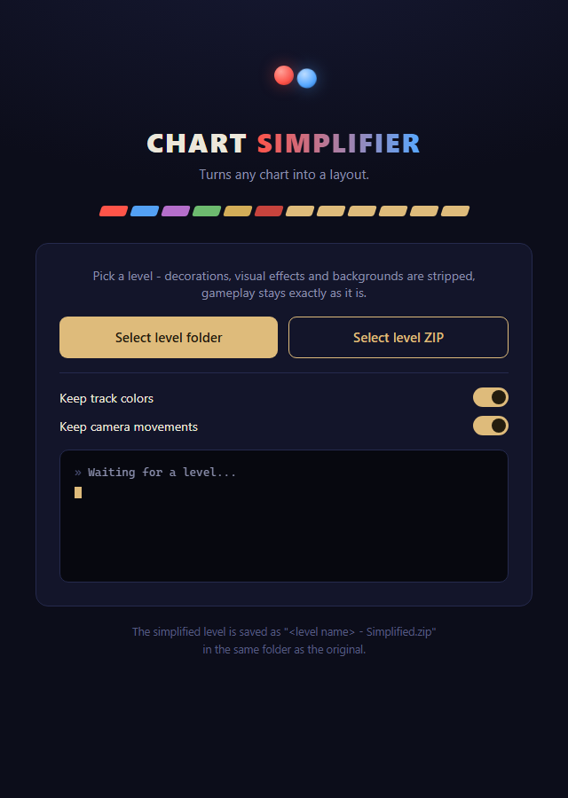

# ChartSimplifier

**It turns any chart into a layout.**

ChartSimplifier strips an [A Dance of Fire and Ice](https://store.steampowered.com/app/977950/) level down to its raw layout: all decorations, visual effects and backgrounds are removed while every gameplay element stays exactly as it is. Perfect for practicing a chart without the visual noise, or for studying how a level is built.



## What it does

Give it a level **folder** or a **ZIP** (nested folders are fine) and it produces
`<level name> - Simplified.zip` in the same folder as the original. It runs in its
own native window - no browser, no console.

### Options

- **Keep track colors** (on by default) - when off, Set Track Color / Recolor Track
  events are removed and the track color settings are reset to the defaults.
- **Keep camera movements** (on by default) - when off, all Move Camera events are
  removed and the Camera Settings are reset to defaults with zoom at 130%.

### Removed
- All decorations from the Decorations tab: images, objects and particles (text decorations are kept)
- All decoration events on tiles: Add Decoration, Add Object, Add Particle, Move Decorations, Emit Particle, Set Particle, Set Object
- All visual events: Flash, Set Filter, Set Filter Advanced, Hall of Mirrors, Shake Screen, Bloom, Screen Tile, Screen Scroll, Custom Background
- The video background (Misc Settings)
- Background Settings are reset to the fresh-level defaults
- Image/video files in the level folder that are no longer referenced

### Kept
- **Gameplay:** Set Speed, Twirl, Checkpoint, Set Hitsound, Play Sound, Set Planet Orbit, Paused Beats, Autoplay Tiles, Scale Planets
- **Track:** Move Track, Position Track, Set Track Animation, Set Track Color, Recolor Track
- **Camera:** Move Camera, and Set Frame Rate
- **Text:** Add Text, Set Text, Set Default Text
- **Conveniences & Event Modifiers:** Editor Comment, Bookmark, Repeat Events, Set Conditional Events
- **All DLC events:** Hold, Set Hold Sound, Multi Planet, Freeroam, Freeroam Twirl, Freeroam Remove, Hide Judgement, Timing Window Scale, Planet Radius Scale
- **Settings:** Track, Song, Level, Camera and Misc settings are left alone
- Any event type it doesn't recognize is kept, so gameplay is never broken

## How to run

**Easiest (Windows):** download `ChartSimplifier.exe` from the [latest release](https://github.com/HighStormPVP/ChartSimplifier/releases/latest) and double-click it. No install needed.

**From source:** requires [Python 3.8+](https://www.python.org/downloads/).

```
pip install pywebview
python app.py
```

or double-click `ChartSimplifier.bat` on Windows. (`pywebview` is optional - it
provides the native window. Without it the app opens as an Edge/Chrome app
window, or a browser tab as a last resort.)

**Building the EXE yourself:**

```
pip install pywebview pyinstaller
python -m PyInstaller --onefile --noconsole --name ChartSimplifier --icon icon.ico --add-data "index.html;." app.py
```

Click **Select level folder** or **Select level ZIP**, and watch the console box report what was removed.

## Notes

- Every `.adofai` file in the level (including backups) is simplified.
- The parser self-repairs the malformed JSON that ADOFAI itself writes (missing commas, literal line breaks inside strings), so real-world charts just work.
- The original level is never touched - the simplified copy is written as a new ZIP.
